# Currency Converter App
The Currency Converter is an application that allows users to convert between different currencies using current exchange rates. The application is built with Angular as a frontend and will be deployed on AWS.

## Features
- Convert between different currencies using current exchange rates.
- Input validation to ensure accurate currency conversion.
- Displays the converted amount and exchange rate.
- Supports multiple currencies.
- Automatically retrieves daily exchange rates from an API.

## Cloud Architecture
The architecture of the Currency Converter application is described in the [CloudArchitecture.md](CloudArchitecture.md) document.

## Deployment
The Currency Converter application will be deployed on AWS with a CI/CD pipeline, which will be exposed in the [Deployment.md](Deployment.md) document.

---

## Contribute! 
Your help and feedback is always welcome!

If you'd like to contribute to the project, please submit a pull request or contact me for more information.

## Support
Feel free to open an issue for bugs and feature requests here in the repo.